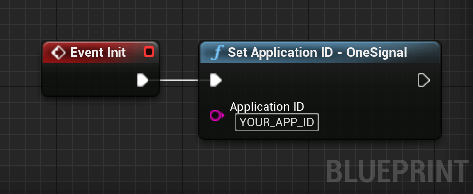

# Get Started - OneSignal

This guide gets you started for using OneSignal in Unreal Engine.

## Creating an Application <span class="duration">&lt; 5 minutes</span>
1. If you haven't already, sign up for a free account on <a href="https://onesignal.com/" target="_blank" noreferrer noopener>onesignal.com</a>.
2. Go to <a href="https://app.onesignal.com/apps/new" target="_blank" noreferrer noopener>onesignal.com/apps/new</a> to create a new app.
3. Enter a name for your application, select your platform (other platforms can be configured afterward) and click `Next: Configure Your Platform`.

<div class="centered">

</div>

4. Follow the steps for [iOS](/getstarted?id=apple-ios-apns-10-15-minutes) or [Android](/getstarted?id=google-android-fcm-5-8-minutes) according the platform selected previously to finish the setup.

## Platform Setup

### Apple iOS (APNs) <span class="duration">10 - 15 minutes</span>
These steps will guide you to generate an APN certificate and upload it to OneSignal.

1. Open the `Keychain Access.app` application (installed by default on MacOS).
2. Select `Keychain Access` > `Certificate Assistant` > `Request a Certificate From a Certificate Authority...`.

<div class="centered">

</div>

3. Fill in your email address, your common name, tick the `Saved to disk` option and click `Continue`.

<div class="centered">

</div>

4. Choose the path where you want to save the `CertificateSigningRequest.certSigningRequest` file and remember its location.

5. Open the <a href="https://developer.apple.com/account/resources/identifiers/list" target="_blank" noreferrer noopener>Apple Developer Console</a>.
6. In the left panel, select `Identifiers` and click on the identifier used by your application.

<div class="centered">

</div>

7. Scroll down until you see the `Push Notifications` capability and tick its corresponding checkbox.

<div class="centered">

</div>

8. Click on the `Save` button in the top right corner.
9. Head back to the <a href="https://developer.apple.com/account/resources/certificates/list" target="_blank" noreferrer noopener>Apple Developer Console</a> and select `Certificates`
10. Click on the blue `+` button to create a new certificate.

<div class="centered">

</div>

11. Under the `Services` category, select `Apple Push Notification service SSL (Sandbox & Production)`.

<div class="centered">

</div>

12. Click on `Continue` at the top of the page.
13. Select the application ID associated with your application and click on `Continue`.

<div class="centered">

</div>

14. Click on `Choose File`, select the `CertificateSigningRequest.certSigningRequest` file created previously and click `Continue`.

<div class="centered">

</div>

15. Click on `Download` to download the newly created certificate.
16. Locate the downloaded certificate in finder (the default name is `aps.cer`) and double click it to install it in the device's keychain.
17. Open the `Keychain Access.app` application.
18. In the `login` keychain, under the `Certificates` category, locate the newly added certificate called `Apple Push Services: com.{yourpackage}.{yourapp}`.

!> Make sure to select the `login` keychain as otherwise you won't have the possibility to export as a `.p12` file.

19. Right click the certificate and select `Export Apple Push Services: ...`.

<div class="centered">

</div>

20. Save the certificate as a `.p12` file (default format).
21. You can optionally set a password to the file. If you set a password, you will have to set it in OneSignal as well.
22. Go back to the OneSignal Apple iOS (APNs) configuration page.
23. Click on `Upload` and upload the `.p12` file generated previously. As password, leave the field empty if you did not setup a password when you saved the `.p12` file. Otherwise, fill in your password. Finally, click on `Save & Continue`.

<div class="centered">

</div>

24. Select `Other SDK` and click `Save & Continue`.

<div class="centered">

</div>

25. Click on `Done` to finish the iOS setup.
26. Follow the [Unreal Engine Setup](/getstarted?id=unreal-engine-setup-lt-5-minutes) to finish the integration.

### Google Android (FCM) <span class="duration">5 - 8 minutes</span>
These steps will guide you to generate a Firebase Server Key and a Firebase Sender ID.

1. If you don't have one already, create a <a href="https://firebase.google.com/" target="_blank" noreferrer noopener>new Firebase account</a> and a <a href="https://console.firebase.google.com/u/0/"  target="_blank" noreferrer noopener>new Firebase App</a>.
2. In the <a href="https://console.firebase.google.com/u/0/"  target="_blank" noreferrer noopener>Firebase Console</a>, click on the bolt next to `Project Overview` and select `Project settings`.


<div class="centered">

</div>

3. Under the `Cloud Messaging` category, click on `Add server key` to generate a new server key.

<div class="centered">

</div>

4. Copy the `Server Key` and the `Sender ID` and paste them in their corresponding fields in the OneSignal Google Android setup page. Finish by clicking `Save & Continue`.

<div class="centered">

</div>

5. Select `Other SDK` and click `Save & Continue`.

<div class="centered">

</div>

6. Click on `Done` to finish the Android setup.
7. Follow the [Unreal Engine Setup](/getstarted?id=unreal-engine-setup-lt-5-minutes) to finish the integration.

## Unreal Engine Setup <span class="duration">&lt; 5 minutes</span>

### Set the Application ID
To link your Unreal Engine application to the OneSignal application created previously, we need to tell the application which Application ID it should be using. For that:

1. Open <a href="https://app.onesignal.com/apps/" target="_blank" noreferrer noopener>onesignal.com</a> and select your application.
2. Click on `Settings` > `Keys & IDs` and copy your OneSignal App ID.

<div class="centered">

</div>

3. Head back to Unreal Engine and add a call to the `Set Application ID` method, typically in the Game Instance.


<div class="code-switcher show-cpp-false">
<div class="switcher" >
<span class="sw-bp" onclick="switchBp()">Blueprints</span><span class="sw-cpp" onclick="switchCpp()">C++</span>
</div>
<div class="cpp">

```cpp
#include "OneSignal/OneSignalLibrary.h

// Called when the game instance is started either normally or through PIE.
void UMyGameInstance::OnStart()
{
    Super::OnStart();

    // We set the application ID as soon as the GameInstance starts.
    UOneSignalLibrary::SetAppID(TEXT("YOUR_APPLICATION_ID"));
}

```

</div>
<div class="bp">
<div class="bpcode">
<textarea readonly>
Begin Object Class=/Script/BlueprintGraph.K2Node_Event Name="K2Node_Event_0"
   EventReference=(MemberParent=Class'"/Script/Engine.GameInstance"',MemberName="ReceiveInit")
   bOverrideFunction=True
   NodePosX=368
   NodePosY=464
   NodeGuid=8C42E1124ED6FC557D1F9E94E342044D
   CustomProperties Pin (PinId=4FE3F3764A0CD1B7819A7CAEC7CCCB38,PinName="OutputDelegate",Direction="EGPD_Output",PinType.PinCategory="delegate",PinType.PinSubCategory="",PinType.PinSubCategoryObject=None,PinType.PinSubCategoryMemberReference=(MemberParent=Class'"/Script/Engine.GameInstance"',MemberName="ReceiveInit"),PinType.PinValueType=(),PinType.ContainerType=None,PinType.bIsReference=False,PinType.bIsConst=False,PinType.bIsWeakPointer=False,PinType.bIsUObjectWrapper=False,PersistentGuid=00000000000000000000000000000000,bHidden=False,bNotConnectable=False,bDefaultValueIsReadOnly=False,bDefaultValueIsIgnored=False,bAdvancedView=False,bOrphanedPin=False,)
   CustomProperties Pin (PinId=F3843A18457C32617FE444AFDD95E702,PinName="then",Direction="EGPD_Output",PinType.PinCategory="exec",PinType.PinSubCategory="",PinType.PinSubCategoryObject=None,PinType.PinSubCategoryMemberReference=(),PinType.PinValueType=(),PinType.ContainerType=None,PinType.bIsReference=False,PinType.bIsConst=False,PinType.bIsWeakPointer=False,PinType.bIsUObjectWrapper=False,LinkedTo=(K2Node_CallFunction_0 D3B0109342955A0ED92DD882BEA5047F,),PersistentGuid=00000000000000000000000000000000,bHidden=False,bNotConnectable=False,bDefaultValueIsReadOnly=False,bDefaultValueIsIgnored=False,bAdvancedView=False,bOrphanedPin=False,)
End Object
Begin Object Class=/Script/BlueprintGraph.K2Node_CallFunction Name="K2Node_CallFunction_0"
   FunctionReference=(MemberParent=Class'"/Script/OneSignal.OneSignalLibrary"',MemberName="SetAppID")
   NodePosX=528
   NodePosY=464
   NodeGuid=987FA6914CFBEB433FA4619B31E9C11B
   CustomProperties Pin (PinId=D3B0109342955A0ED92DD882BEA5047F,PinName="execute",PinToolTip="\nExec",PinType.PinCategory="exec",PinType.PinSubCategory="",PinType.PinSubCategoryObject=None,PinType.PinSubCategoryMemberReference=(),PinType.PinValueType=(),PinType.ContainerType=None,PinType.bIsReference=False,PinType.bIsConst=False,PinType.bIsWeakPointer=False,PinType.bIsUObjectWrapper=False,LinkedTo=(K2Node_Event_0 F3843A18457C32617FE444AFDD95E702,),PersistentGuid=00000000000000000000000000000000,bHidden=False,bNotConnectable=False,bDefaultValueIsReadOnly=False,bDefaultValueIsIgnored=False,bAdvancedView=False,bOrphanedPin=False,)
   CustomProperties Pin (PinId=B9ACEC654CB1B177DEB45CBB2F85C4DF,PinName="then",PinToolTip="\nExec",Direction="EGPD_Output",PinType.PinCategory="exec",PinType.PinSubCategory="",PinType.PinSubCategoryObject=None,PinType.PinSubCategoryMemberReference=(),PinType.PinValueType=(),PinType.ContainerType=None,PinType.bIsReference=False,PinType.bIsConst=False,PinType.bIsWeakPointer=False,PinType.bIsUObjectWrapper=False,PersistentGuid=00000000000000000000000000000000,bHidden=False,bNotConnectable=False,bDefaultValueIsReadOnly=False,bDefaultValueIsIgnored=False,bAdvancedView=False,bOrphanedPin=False,)
   CustomProperties Pin (PinId=9DB7EED74DE28F57B69134B1A09ED4B2,PinName="self",PinFriendlyName=NSLOCTEXT("K2Node", "Target", "Target"),PinToolTip="Target\nOne Signal Library Object Reference",PinType.PinCategory="object",PinType.PinSubCategory="",PinType.PinSubCategoryObject=Class'"/Script/OneSignal.OneSignalLibrary"',PinType.PinSubCategoryMemberReference=(),PinType.PinValueType=(),PinType.ContainerType=None,PinType.bIsReference=False,PinType.bIsConst=False,PinType.bIsWeakPointer=False,PinType.bIsUObjectWrapper=False,DefaultObject="/Script/OneSignal.Default__OneSignalLibrary",PersistentGuid=00000000000000000000000000000000,bHidden=True,bNotConnectable=False,bDefaultValueIsReadOnly=False,bDefaultValueIsIgnored=False,bAdvancedView=False,bOrphanedPin=False,)
   CustomProperties Pin (PinId=EFC0EE644C77D803236B59A3C95F6981,PinName="ApplicationID",PinToolTip="Application ID\nString\n\nThe One Signal Application ID to set.",PinType.PinCategory="string",PinType.PinSubCategory="",PinType.PinSubCategoryObject=None,PinType.PinSubCategoryMemberReference=(),PinType.PinValueType=(),PinType.ContainerType=None,PinType.bIsReference=False,PinType.bIsConst=False,PinType.bIsWeakPointer=False,PinType.bIsUObjectWrapper=False,DefaultValue="YOUR_APP_ID",PersistentGuid=00000000000000000000000000000000,bHidden=False,bNotConnectable=False,bDefaultValueIsReadOnly=False,bDefaultValueIsIgnored=False,bAdvancedView=False,bOrphanedPin=False,)
End Object
</textarea>

<button onclick="copyBlueprintCode(this)">Copy Code</button>
</div>
</div>
</div>

### Initialize the OneSignal SDK

To finalize the setup, the OneSignal SDK needs to be initialized when your application starts. To do so, add a call to the `Initialize` method after setting your application ID.


<div class="code-switcher show-cpp-false">
<div class="switcher" >
<span class="sw-bp" onclick="switchBp()">Blueprints</span><span class="sw-cpp" onclick="switchCpp()">C++</span>
</div>
<div class="cpp">

```cpp
#include "OneSignal/OneSignalLibrary.h

// Called when the game instance is started either normally or through PIE.
void UMyGameInstance::OnStart()
{
    Super::OnStart();

    // We set the application ID as soon as the GameInstance starts.
    UOneSignalLibrary::SetAppID(TEXT("YOUR_APPLICATION_ID"));

    // We initialize the OneSignal SDK.
    UOneSignalLibrary::Initialize();
}

```

</div>
<div class="bp">
<div class="bpcode">
<textarea readonly>
Begin Object Class=/Script/BlueprintGraph.K2Node_Event Name="K2Node_Event_0"
   EventReference=(MemberParent=Class'"/Script/Engine.GameInstance"',MemberName="ReceiveInit")
   bOverrideFunction=True
   NodePosX=368
   NodePosY=464
   NodeGuid=8C42E1124ED6FC557D1F9E94E342044D
   CustomProperties Pin (PinId=4FE3F3764A0CD1B7819A7CAEC7CCCB38,PinName="OutputDelegate",Direction="EGPD_Output",PinType.PinCategory="delegate",PinType.PinSubCategory="",PinType.PinSubCategoryObject=None,PinType.PinSubCategoryMemberReference=(MemberParent=Class'"/Script/Engine.GameInstance"',MemberName="ReceiveInit"),PinType.PinValueType=(),PinType.ContainerType=None,PinType.bIsReference=False,PinType.bIsConst=False,PinType.bIsWeakPointer=False,PinType.bIsUObjectWrapper=False,PersistentGuid=00000000000000000000000000000000,bHidden=False,bNotConnectable=False,bDefaultValueIsReadOnly=False,bDefaultValueIsIgnored=False,bAdvancedView=False,bOrphanedPin=False,)
   CustomProperties Pin (PinId=F3843A18457C32617FE444AFDD95E702,PinName="then",Direction="EGPD_Output",PinType.PinCategory="exec",PinType.PinSubCategory="",PinType.PinSubCategoryObject=None,PinType.PinSubCategoryMemberReference=(),PinType.PinValueType=(),PinType.ContainerType=None,PinType.bIsReference=False,PinType.bIsConst=False,PinType.bIsWeakPointer=False,PinType.bIsUObjectWrapper=False,LinkedTo=(K2Node_CallFunction_0 D3B0109342955A0ED92DD882BEA5047F,),PersistentGuid=00000000000000000000000000000000,bHidden=False,bNotConnectable=False,bDefaultValueIsReadOnly=False,bDefaultValueIsIgnored=False,bAdvancedView=False,bOrphanedPin=False,)
End Object
Begin Object Class=/Script/BlueprintGraph.K2Node_CallFunction Name="K2Node_CallFunction_0"
   FunctionReference=(MemberParent=Class'"/Script/OneSignal.OneSignalLibrary"',MemberName="SetAppID")
   NodePosX=528
   NodePosY=464
   NodeGuid=987FA6914CFBEB433FA4619B31E9C11B
   CustomProperties Pin (PinId=D3B0109342955A0ED92DD882BEA5047F,PinName="execute",PinToolTip="\nExec",PinType.PinCategory="exec",PinType.PinSubCategory="",PinType.PinSubCategoryObject=None,PinType.PinSubCategoryMemberReference=(),PinType.PinValueType=(),PinType.ContainerType=None,PinType.bIsReference=False,PinType.bIsConst=False,PinType.bIsWeakPointer=False,PinType.bIsUObjectWrapper=False,LinkedTo=(K2Node_Event_0 F3843A18457C32617FE444AFDD95E702,),PersistentGuid=00000000000000000000000000000000,bHidden=False,bNotConnectable=False,bDefaultValueIsReadOnly=False,bDefaultValueIsIgnored=False,bAdvancedView=False,bOrphanedPin=False,)
   CustomProperties Pin (PinId=B9ACEC654CB1B177DEB45CBB2F85C4DF,PinName="then",PinToolTip="\nExec",Direction="EGPD_Output",PinType.PinCategory="exec",PinType.PinSubCategory="",PinType.PinSubCategoryObject=None,PinType.PinSubCategoryMemberReference=(),PinType.PinValueType=(),PinType.ContainerType=None,PinType.bIsReference=False,PinType.bIsConst=False,PinType.bIsWeakPointer=False,PinType.bIsUObjectWrapper=False,LinkedTo=(K2Node_CallFunction_1 753E2E4C4294D3E4C0B073BF4858E2CF,),PersistentGuid=00000000000000000000000000000000,bHidden=False,bNotConnectable=False,bDefaultValueIsReadOnly=False,bDefaultValueIsIgnored=False,bAdvancedView=False,bOrphanedPin=False,)
   CustomProperties Pin (PinId=9DB7EED74DE28F57B69134B1A09ED4B2,PinName="self",PinFriendlyName=NSLOCTEXT("K2Node", "Target", "Target"),PinToolTip="Target\nOne Signal Library Object Reference",PinType.PinCategory="object",PinType.PinSubCategory="",PinType.PinSubCategoryObject=Class'"/Script/OneSignal.OneSignalLibrary"',PinType.PinSubCategoryMemberReference=(),PinType.PinValueType=(),PinType.ContainerType=None,PinType.bIsReference=False,PinType.bIsConst=False,PinType.bIsWeakPointer=False,PinType.bIsUObjectWrapper=False,DefaultObject="/Script/OneSignal.Default__OneSignalLibrary",PersistentGuid=00000000000000000000000000000000,bHidden=True,bNotConnectable=False,bDefaultValueIsReadOnly=False,bDefaultValueIsIgnored=False,bAdvancedView=False,bOrphanedPin=False,)
   CustomProperties Pin (PinId=EFC0EE644C77D803236B59A3C95F6981,PinName="ApplicationID",PinToolTip="Application ID\nString\n\nThe One Signal Application ID to set.",PinType.PinCategory="string",PinType.PinSubCategory="",PinType.PinSubCategoryObject=None,PinType.PinSubCategoryMemberReference=(),PinType.PinValueType=(),PinType.ContainerType=None,PinType.bIsReference=False,PinType.bIsConst=False,PinType.bIsWeakPointer=False,PinType.bIsUObjectWrapper=False,DefaultValue="YOUR_APP_ID",PersistentGuid=00000000000000000000000000000000,bHidden=False,bNotConnectable=False,bDefaultValueIsReadOnly=False,bDefaultValueIsIgnored=False,bAdvancedView=False,bOrphanedPin=False,)
End Object
Begin Object Class=/Script/BlueprintGraph.K2Node_CallFunction Name="K2Node_CallFunction_1"
   FunctionReference=(MemberParent=Class'"/Script/OneSignal.OneSignalLibrary"',MemberName="Initialize")
   NodePosX=816
   NodePosY=464
   NodeGuid=DF00BE5D4EE655E5CE51B586A6600EF9
   CustomProperties Pin (PinId=753E2E4C4294D3E4C0B073BF4858E2CF,PinName="execute",PinToolTip="\nExec",PinType.PinCategory="exec",PinType.PinSubCategory="",PinType.PinSubCategoryObject=None,PinType.PinSubCategoryMemberReference=(),PinType.PinValueType=(),PinType.ContainerType=None,PinType.bIsReference=False,PinType.bIsConst=False,PinType.bIsWeakPointer=False,PinType.bIsUObjectWrapper=False,LinkedTo=(K2Node_CallFunction_0 B9ACEC654CB1B177DEB45CBB2F85C4DF,),PersistentGuid=00000000000000000000000000000000,bHidden=False,bNotConnectable=False,bDefaultValueIsReadOnly=False,bDefaultValueIsIgnored=False,bAdvancedView=False,bOrphanedPin=False,)
   CustomProperties Pin (PinId=67F5B883408EA77F5424B383BFD0BAA1,PinName="then",PinToolTip="\nExec",Direction="EGPD_Output",PinType.PinCategory="exec",PinType.PinSubCategory="",PinType.PinSubCategoryObject=None,PinType.PinSubCategoryMemberReference=(),PinType.PinValueType=(),PinType.ContainerType=None,PinType.bIsReference=False,PinType.bIsConst=False,PinType.bIsWeakPointer=False,PinType.bIsUObjectWrapper=False,PersistentGuid=00000000000000000000000000000000,bHidden=False,bNotConnectable=False,bDefaultValueIsReadOnly=False,bDefaultValueIsIgnored=False,bAdvancedView=False,bOrphanedPin=False,)
   CustomProperties Pin (PinId=218948B34FF2263D4CD608B669FED0A0,PinName="self",PinFriendlyName=NSLOCTEXT("K2Node", "Target", "Target"),PinToolTip="Target\nOne Signal Library Object Reference",PinType.PinCategory="object",PinType.PinSubCategory="",PinType.PinSubCategoryObject=Class'"/Script/OneSignal.OneSignalLibrary"',PinType.PinSubCategoryMemberReference=(),PinType.PinValueType=(),PinType.ContainerType=None,PinType.bIsReference=False,PinType.bIsConst=False,PinType.bIsWeakPointer=False,PinType.bIsUObjectWrapper=False,DefaultObject="/Script/OneSignal.Default__OneSignalLibrary",PersistentGuid=00000000000000000000000000000000,bHidden=True,bNotConnectable=False,bDefaultValueIsReadOnly=False,bDefaultValueIsIgnored=False,bAdvancedView=False,bOrphanedPin=False,)
End Object
</textarea>

<button onclick="copyBlueprintCode(this)">Copy Code</button>
</div>
</div>
</div>

And that's it, your application is ready. Users will appear as you launch the app under `Audience` > `All Users`.


## Add a Test User <span class="duration">&lt; 2 minutes</span>
It is recommended to add your test device as a test user to easily test push notifications or in-app messages. To add a user as a test user:

1. Make sure you followed the integration steps above for your platform.
2. Run your application on a device once to see your device appear under `Audience` > `All Users`.
3. Click on `Options` > `Add to Test Users`.


<div class="centered">

</div>

!> If you uninstall and reinstall the app, a new user might be created for a specific device. If it happens, you have to follow this procedure **again**.


<script>
setTimeout(() => {
	bShowCPP = !JSON.parse(getCookie('bShowCPP'));
	switchCode();
}, 0);
</script>


