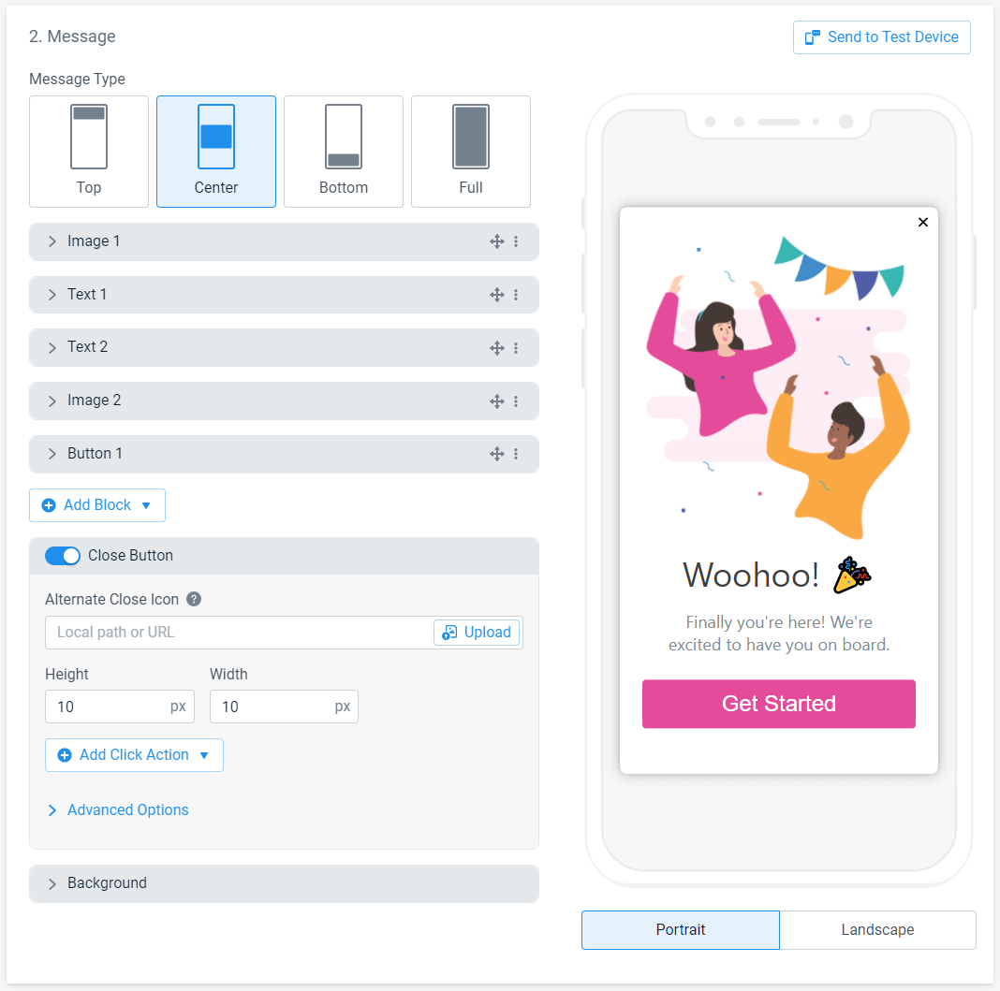
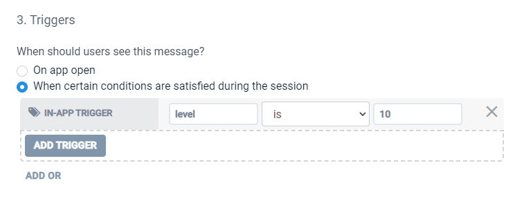

# Quick Start - In-App Messaging

!> This section assumes you have already setup OneSignal in your application as shown in [Get Started](/getstarted).

## Edit a Default In-App Message

OneSignal has by default several In-App Message templates. The following steps show how to edit the `Welcome Message` that appears on app startup.

1. Open <a href="https://app.onesignal.com/apps/" target="_blank" noreferrer noopener>onesignal.com</a> and select your application.
2. Go to `Messages` > `In-App`, click on the three blue dots at the right of the `Welcome Message` In-App and click on `Edit`.

<div class="centered">

</div>

3. Modify the template until it suits you.
4. Open the app on your device and click on `Send to Test Device` in the OneSignal console.

<div class="centered">

</div>

5. Select your device an click `Send`.

<div class="centered">

</div>

6. Observe the result of your changes on your device and, if the final results suits you, click on `Update Message` to save your chages.

## Enable a Default In-App Message
An In-App Message won't show to your users until you enable it. To enable an In-App message:

1. Open <a href="https://app.onesignal.com/apps/" target="_blank" noreferrer noopener>onesignal.com</a> and select your application.
2. Go to `Messages` > `In-App`, click on the three blue dots at the right of the `Welcome Message` In-App and click on `Resume`.

## Edit Showing Conditions

The conditions required to show a specific In-App Message can be modified from the OneSignal console:

1. Open <a href="https://app.onesignal.com/apps/" target="_blank" noreferrer noopener>onesignal.com</a> and select your application.
2. Go to `Messages` > `In-App`, click on the three blue dots at the right of the `Welcome Message` In-App and click on `Edit`.

<div class="centered">

</div>

3. Under the `Triggers` category, choose `When certain conditions are satisfied during the session` and click on `IN-APP TRIGGER`.
4. Add a trigger name and a value that meets the condition to show the In-App Message. Typically, if you wanted to show a specific app message to users of level **10**, you would add the following:

<div class="centered">

</div>

5. In Unreal Engine, update the showing condition based on your game's logic. For the condition based on the player's level, we woul add the following:

<div class="code-switcher show-cpp-false">
<div class="switcher" >
<span class="sw-bp" onclick="switchBp()">Blueprints</span><span class="sw-cpp" onclick="switchCpp()">C++</span>
</div>
<div class="cpp">

```cpp
void UMyCharacter::OnLevelUp()
{
    UOneSignalLibrary::AddTrigger(TEXT("level"), FString::FromInt(GetLevel()));
}
```

</div>
<div class="bp">
<div class="bpcode">
<textarea readonly>
Begin Object Class=/Script/BlueprintGraph.K2Node_CallFunction Name="K2Node_CallFunction_24"
   FunctionReference=(MemberParent=Class'"/Script/OneSignal.OneSignalLibrary"',MemberName="AddTrigger")
   NodePosX=2448
   NodePosY=160
   NodeGuid=69AC0C1340136E7910D5DE8FD8B20827
   CustomProperties Pin (PinId=6D322BB849B7ECD0FD15E7945113FF40,PinName="execute",PinToolTip="\nExec",PinType.PinCategory="exec",PinType.PinSubCategory="",PinType.PinSubCategoryObject=None,PinType.PinSubCategoryMemberReference=(),PinType.PinValueType=(),PinType.ContainerType=None,PinType.bIsReference=False,PinType.bIsConst=False,PinType.bIsWeakPointer=False,PinType.bIsUObjectWrapper=False,LinkedTo=(K2Node_CustomEvent_12 C2E76D574681CCB4C983D7A120986F9F,),PersistentGuid=00000000000000000000000000000000,bHidden=False,bNotConnectable=False,bDefaultValueIsReadOnly=False,bDefaultValueIsIgnored=False,bAdvancedView=False,bOrphanedPin=False,)
   CustomProperties Pin (PinId=09E417D3448D5C93E1CA90AA43F1CECA,PinName="then",PinToolTip="\nExec",Direction="EGPD_Output",PinType.PinCategory="exec",PinType.PinSubCategory="",PinType.PinSubCategoryObject=None,PinType.PinSubCategoryMemberReference=(),PinType.PinValueType=(),PinType.ContainerType=None,PinType.bIsReference=False,PinType.bIsConst=False,PinType.bIsWeakPointer=False,PinType.bIsUObjectWrapper=False,PersistentGuid=00000000000000000000000000000000,bHidden=False,bNotConnectable=False,bDefaultValueIsReadOnly=False,bDefaultValueIsIgnored=False,bAdvancedView=False,bOrphanedPin=False,)
   CustomProperties Pin (PinId=2698DEE04B09417CA15C6D90CAF6AA97,PinName="self",PinFriendlyName=NSLOCTEXT("K2Node", "Target", "Target"),PinToolTip="Target\nOne Signal Library Object Reference",PinType.PinCategory="object",PinType.PinSubCategory="",PinType.PinSubCategoryObject=Class'"/Script/OneSignal.OneSignalLibrary"',PinType.PinSubCategoryMemberReference=(),PinType.PinValueType=(),PinType.ContainerType=None,PinType.bIsReference=False,PinType.bIsConst=False,PinType.bIsWeakPointer=False,PinType.bIsUObjectWrapper=False,DefaultObject="/Script/OneSignal.Default__OneSignalLibrary",PersistentGuid=00000000000000000000000000000000,bHidden=True,bNotConnectable=False,bDefaultValueIsReadOnly=False,bDefaultValueIsIgnored=False,bAdvancedView=False,bOrphanedPin=False,)
   CustomProperties Pin (PinId=34039D964E6138552D60EA833BE6C463,PinName="Key",PinToolTip="Key\nString",PinType.PinCategory="string",PinType.PinSubCategory="",PinType.PinSubCategoryObject=None,PinType.PinSubCategoryMemberReference=(),PinType.PinValueType=(),PinType.ContainerType=None,PinType.bIsReference=False,PinType.bIsConst=False,PinType.bIsWeakPointer=False,PinType.bIsUObjectWrapper=False,DefaultValue="level",PersistentGuid=00000000000000000000000000000000,bHidden=False,bNotConnectable=False,bDefaultValueIsReadOnly=False,bDefaultValueIsIgnored=False,bAdvancedView=False,bOrphanedPin=False,)
   CustomProperties Pin (PinId=D238406144A690BB81A5C2A968F10522,PinName="Value",PinToolTip="Value\nString",PinType.PinCategory="string",PinType.PinSubCategory="",PinType.PinSubCategoryObject=None,PinType.PinSubCategoryMemberReference=(),PinType.PinValueType=(),PinType.ContainerType=None,PinType.bIsReference=False,PinType.bIsConst=False,PinType.bIsWeakPointer=False,PinType.bIsUObjectWrapper=False,LinkedTo=(K2Node_CallFunction_30 4E117FCB49CC6B78AF2151AF335A3B0C,),PersistentGuid=00000000000000000000000000000000,bHidden=False,bNotConnectable=False,bDefaultValueIsReadOnly=False,bDefaultValueIsIgnored=False,bAdvancedView=False,bOrphanedPin=False,)
End Object
Begin Object Class=/Script/BlueprintGraph.K2Node_CustomEvent Name="K2Node_CustomEvent_12"
   CustomFunctionName="On Player Level Up"
   NodePosX=2192
   NodePosY=144
   NodeGuid=F9DE7E98435DB39A21480381DE5E83B6
   CustomProperties Pin (PinId=6381D7E643F1FFCA5BBC66A1B6277370,PinName="OutputDelegate",Direction="EGPD_Output",PinType.PinCategory="delegate",PinType.PinSubCategory="",PinType.PinSubCategoryObject=None,PinType.PinSubCategoryMemberReference=(MemberParent=BlueprintGeneratedClass'"/Game/TestActor.TestActor_C"',MemberName="On Player Level Up",MemberGuid=F9DE7E98435DB39A21480381DE5E83B6),PinType.PinValueType=(),PinType.ContainerType=None,PinType.bIsReference=False,PinType.bIsConst=False,PinType.bIsWeakPointer=False,PinType.bIsUObjectWrapper=False,PersistentGuid=00000000000000000000000000000000,bHidden=False,bNotConnectable=False,bDefaultValueIsReadOnly=False,bDefaultValueIsIgnored=False,bAdvancedView=False,bOrphanedPin=False,)
   CustomProperties Pin (PinId=C2E76D574681CCB4C983D7A120986F9F,PinName="then",Direction="EGPD_Output",PinType.PinCategory="exec",PinType.PinSubCategory="",PinType.PinSubCategoryObject=None,PinType.PinSubCategoryMemberReference=(),PinType.PinValueType=(),PinType.ContainerType=None,PinType.bIsReference=False,PinType.bIsConst=False,PinType.bIsWeakPointer=False,PinType.bIsUObjectWrapper=False,LinkedTo=(K2Node_CallFunction_24 6D322BB849B7ECD0FD15E7945113FF40,),PersistentGuid=00000000000000000000000000000000,bHidden=False,bNotConnectable=False,bDefaultValueIsReadOnly=False,bDefaultValueIsIgnored=False,bAdvancedView=False,bOrphanedPin=False,)
End Object
Begin Object Class=/Script/BlueprintGraph.K2Node_CallFunction Name="K2Node_CallFunction_27"
   bIsPureFunc=True
   FunctionReference=(MemberName="GetPlayerLevel",MemberGuid=F1C78DFD4115CA1A52ACE3B7CFF48405,bSelfContext=True)
   NodePosX=2112
   NodePosY=256
   NodeGuid=5C83D3104B2842FC15811B90BD9A36AD
   CustomProperties Pin (PinId=68A713D344C82248076E2CBBB9B54347,PinName="self",PinFriendlyName=NSLOCTEXT("K2Node", "Target", "Target"),PinToolTip="Target\nSelf Object Reference",PinType.PinCategory="object",PinType.PinSubCategory="self",PinType.PinSubCategoryObject=None,PinType.PinSubCategoryMemberReference=(),PinType.PinValueType=(),PinType.ContainerType=None,PinType.bIsReference=False,PinType.bIsConst=False,PinType.bIsWeakPointer=False,PinType.bIsUObjectWrapper=False,PersistentGuid=00000000000000000000000000000000,bHidden=True,bNotConnectable=False,bDefaultValueIsReadOnly=False,bDefaultValueIsIgnored=False,bAdvancedView=False,bOrphanedPin=False,)
   CustomProperties Pin (PinId=F0D3327845BA2132A0BFCCA4E3436BA3,PinName="Level",PinToolTip="Level\nInteger",Direction="EGPD_Output",PinType.PinCategory="int",PinType.PinSubCategory="",PinType.PinSubCategoryObject=None,PinType.PinSubCategoryMemberReference=(),PinType.PinValueType=(),PinType.ContainerType=None,PinType.bIsReference=False,PinType.bIsConst=False,PinType.bIsWeakPointer=False,PinType.bIsUObjectWrapper=False,DefaultValue="0",AutogeneratedDefaultValue="0",LinkedTo=(K2Node_CallFunction_30 EE25E3864D337E6BCDFD21B3EF3BF189,),PersistentGuid=00000000000000000000000000000000,bHidden=False,bNotConnectable=False,bDefaultValueIsReadOnly=False,bDefaultValueIsIgnored=False,bAdvancedView=False,bOrphanedPin=False,)
End Object
Begin Object Class=/Script/BlueprintGraph.K2Node_CallFunction Name="K2Node_CallFunction_30"
   bIsPureFunc=True
   FunctionReference=(MemberParent=Class'"/Script/Engine.KismetStringLibrary"',MemberName="Conv_IntToString")
   NodePosX=2304
   NodePosY=256
   NodeGuid=013835534D09487903F0D88C3064D815
   CustomProperties Pin (PinId=E453131F4ABF69BF957B7FA6FA55814A,PinName="self",PinFriendlyName=NSLOCTEXT("K2Node", "Target", "Target"),PinToolTip="Target\nKismet String Library Object Reference",PinType.PinCategory="object",PinType.PinSubCategory="",PinType.PinSubCategoryObject=Class'"/Script/Engine.KismetStringLibrary"',PinType.PinSubCategoryMemberReference=(),PinType.PinValueType=(),PinType.ContainerType=None,PinType.bIsReference=False,PinType.bIsConst=False,PinType.bIsWeakPointer=False,PinType.bIsUObjectWrapper=False,DefaultObject="/Script/Engine.Default__KismetStringLibrary",PersistentGuid=00000000000000000000000000000000,bHidden=True,bNotConnectable=False,bDefaultValueIsReadOnly=False,bDefaultValueIsIgnored=False,bAdvancedView=False,bOrphanedPin=False,)
   CustomProperties Pin (PinId=EE25E3864D337E6BCDFD21B3EF3BF189,PinName="InInt",PinToolTip="In Int\nInteger",PinType.PinCategory="int",PinType.PinSubCategory="",PinType.PinSubCategoryObject=None,PinType.PinSubCategoryMemberReference=(),PinType.PinValueType=(),PinType.ContainerType=None,PinType.bIsReference=False,PinType.bIsConst=False,PinType.bIsWeakPointer=False,PinType.bIsUObjectWrapper=False,DefaultValue="0",AutogeneratedDefaultValue="0",LinkedTo=(K2Node_CallFunction_27 F0D3327845BA2132A0BFCCA4E3436BA3,),PersistentGuid=00000000000000000000000000000000,bHidden=False,bNotConnectable=False,bDefaultValueIsReadOnly=False,bDefaultValueIsIgnored=False,bAdvancedView=False,bOrphanedPin=False,)
   CustomProperties Pin (PinId=4E117FCB49CC6B78AF2151AF335A3B0C,PinName="ReturnValue",PinToolTip="Return Value\nString\n\nConverts an integer value to a string",Direction="EGPD_Output",PinType.PinCategory="string",PinType.PinSubCategory="",PinType.PinSubCategoryObject=None,PinType.PinSubCategoryMemberReference=(),PinType.PinValueType=(),PinType.ContainerType=None,PinType.bIsReference=False,PinType.bIsConst=False,PinType.bIsWeakPointer=False,PinType.bIsUObjectWrapper=False,LinkedTo=(K2Node_CallFunction_24 D238406144A690BB81A5C2A968F10522,),PersistentGuid=00000000000000000000000000000000,bHidden=False,bNotConnectable=False,bDefaultValueIsReadOnly=False,bDefaultValueIsIgnored=False,bAdvancedView=False,bOrphanedPin=False,)
End Object
</textarea>

<button onclick="copyBlueprintCode(this)">Copy Code</button>
</div>
</div>
</div>


6. And that's it, the In-App Message will show as soon as the condition is met.


<script>
setTimeout(() => {
	bShowCPP = !JSON.parse(getCookie('bShowCPP'));
	switchCode();
}, 0);
</script>


