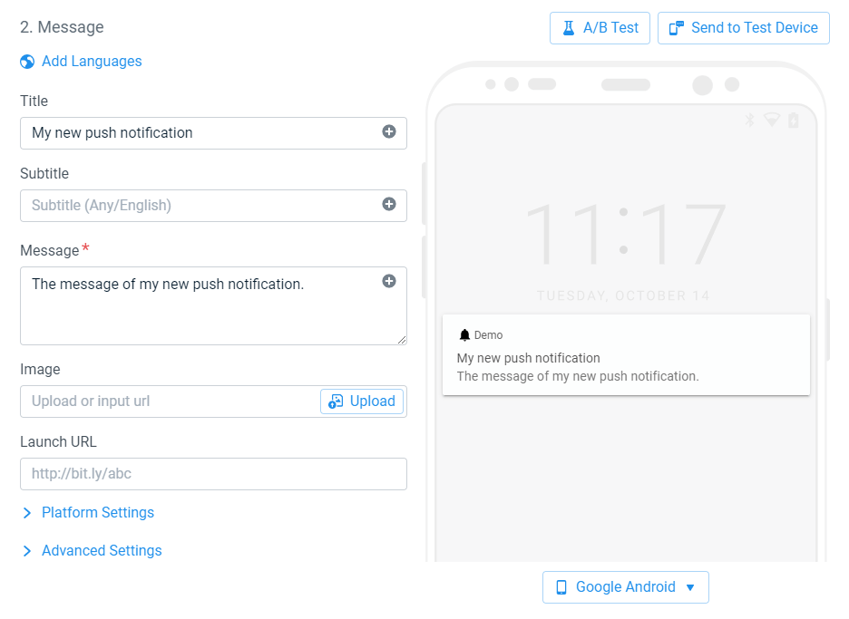

# Quick Start - Push Notifications

!> This section assumes you have already setup OneSignal in your application as shown in [Get Started](/getstarted).

## Send your First Notification

### Additional iOS setup

If you target iOS, you need to request the notification permission to send notifications to your user.

Add a call to `Prompt for Push Notification` to request Push Notifications access after initializing the SDK:

<div class="code-switcher show-cpp-false">
<div class="switcher" >
<span class="sw-bp" onclick="switchBp()">Blueprints</span><span class="sw-cpp" onclick="switchCpp()">C++</span>
</div>
<div class="cpp">

```cpp
UOneSignalLibrary::PromptForPushNotifications(
    FOneSignalUserResponseCallback::CreateLambda([](const bool bAccepted) -> void
{
    if (bAccepted)
    {
        // User agreed to receive push notifications.
    }
    else
    {
        // user refused to receive push notifications.
    }
}));
```

</div>
<div class="bp">
<div class="bpcode">
<textarea readonly>
Begin Object Class=/Script/BlueprintGraph.K2Node_CustomEvent Name="K2Node_CustomEvent_0"
   CustomFunctionName="Prompt for Push"
   NodePosX=704
   NodePosY=47
   NodeGuid=C3964B2649DEC95F265300A5EC81CEEA
   CustomProperties Pin (PinId=AAFAD347412EFCFD6C4E4FA6856F58BF,PinName="OutputDelegate",Direction="EGPD_Output",PinType.PinCategory="delegate",PinType.PinSubCategory="",PinType.PinSubCategoryObject=None,PinType.PinSubCategoryMemberReference=(),PinType.PinValueType=(),PinType.ContainerType=None,PinType.bIsReference=False,PinType.bIsConst=False,PinType.bIsWeakPointer=False,PinType.bIsUObjectWrapper=False,PersistentGuid=00000000000000000000000000000000,bHidden=False,bNotConnectable=False,bDefaultValueIsReadOnly=False,bDefaultValueIsIgnored=False,bAdvancedView=False,bOrphanedPin=False,)
   CustomProperties Pin (PinId=BB49DFC545EF02ED8C39BB87BBF99541,PinName="then",Direction="EGPD_Output",PinType.PinCategory="exec",PinType.PinSubCategory="",PinType.PinSubCategoryObject=None,PinType.PinSubCategoryMemberReference=(),PinType.PinValueType=(),PinType.ContainerType=None,PinType.bIsReference=False,PinType.bIsConst=False,PinType.bIsWeakPointer=False,PinType.bIsUObjectWrapper=False,LinkedTo=(K2Node_AsyncAction_0 3DB424EC462D865B542BD2A0172058D5,),PersistentGuid=00000000000000000000000000000000,bHidden=False,bNotConnectable=False,bDefaultValueIsReadOnly=False,bDefaultValueIsIgnored=False,bAdvancedView=False,bOrphanedPin=False,)
End Object
Begin Object Class=/Script/BlueprintGraph.K2Node_AsyncAction Name="K2Node_AsyncAction_0"
   ProxyFactoryFunctionName="PromptForPushNotifications"
   ProxyFactoryClass=Class'"/Script/OneSignal.OneSignalPromptForPushNotificationsProxy"'
   ProxyClass=Class'"/Script/OneSignal.OneSignalPromptForPushNotificationsProxy"'
   NodePosX=912
   NodePosY=64
   NodeGuid=E30F5E7E4E16EDD2397FDC9C69EAEF2D
   CustomProperties Pin (PinId=3DB424EC462D865B542BD2A0172058D5,PinName="execute",PinToolTip="\nExec",PinType.PinCategory="exec",PinType.PinSubCategory="",PinType.PinSubCategoryObject=None,PinType.PinSubCategoryMemberReference=(),PinType.PinValueType=(),PinType.ContainerType=None,PinType.bIsReference=False,PinType.bIsConst=False,PinType.bIsWeakPointer=False,PinType.bIsUObjectWrapper=False,LinkedTo=(K2Node_CustomEvent_0 BB49DFC545EF02ED8C39BB87BBF99541,),PersistentGuid=00000000000000000000000000000000,bHidden=False,bNotConnectable=False,bDefaultValueIsReadOnly=False,bDefaultValueIsIgnored=False,bAdvancedView=False,bOrphanedPin=False,)
   CustomProperties Pin (PinId=A7AED10742FBF706A7F5BFA5848D786A,PinName="then",Direction="EGPD_Output",PinType.PinCategory="exec",PinType.PinSubCategory="",PinType.PinSubCategoryObject=None,PinType.PinSubCategoryMemberReference=(),PinType.PinValueType=(),PinType.ContainerType=None,PinType.bIsReference=False,PinType.bIsConst=False,PinType.bIsWeakPointer=False,PinType.bIsUObjectWrapper=False,PersistentGuid=00000000000000000000000000000000,bHidden=False,bNotConnectable=False,bDefaultValueIsReadOnly=False,bDefaultValueIsIgnored=False,bAdvancedView=False,bOrphanedPin=False,)
   CustomProperties Pin (PinId=C50764DC4CD9C045D217338239B63C6F,PinName="Accepted",PinFriendlyName=NSLOCTEXT("", "1DDDAF5F41D32730067CDFB1C1763998", "Accepted"),PinToolTip="The user accepted the request.",Direction="EGPD_Output",PinType.PinCategory="exec",PinType.PinSubCategory="",PinType.PinSubCategoryObject=None,PinType.PinSubCategoryMemberReference=(),PinType.PinValueType=(),PinType.ContainerType=None,PinType.bIsReference=False,PinType.bIsConst=False,PinType.bIsWeakPointer=False,PinType.bIsUObjectWrapper=False,PersistentGuid=00000000000000000000000000000000,bHidden=False,bNotConnectable=False,bDefaultValueIsReadOnly=False,bDefaultValueIsIgnored=False,bAdvancedView=False,bOrphanedPin=False,)
   CustomProperties Pin (PinId=01798A004E3D6AB53E2F75B0E984246C,PinName="Denied",PinFriendlyName=NSLOCTEXT("", "3E530C5E481357DAE262BDB86406D403", "Denied"),PinToolTip="The user denied the request.",Direction="EGPD_Output",PinType.PinCategory="exec",PinType.PinSubCategory="",PinType.PinSubCategoryObject=None,PinType.PinSubCategoryMemberReference=(),PinType.PinValueType=(),PinType.ContainerType=None,PinType.bIsReference=False,PinType.bIsConst=False,PinType.bIsWeakPointer=False,PinType.bIsUObjectWrapper=False,PersistentGuid=00000000000000000000000000000000,bHidden=False,bNotConnectable=False,bDefaultValueIsReadOnly=False,bDefaultValueIsIgnored=False,bAdvancedView=False,bOrphanedPin=False,)
End Object
</textarea>

<button onclick="copyBlueprintCode(this)">Copy Code</button>
</div>
</div>
</div>

> While the `Prompt for Push Notifications` method does something on iOS only, you can safely call it on Android as well to avoid platform-specific code. It will instantaneously fire the `Accepted` pin.

### Sending the Notification

It's time to send the first notification.
1. Open <a href="https://app.onesignal.com/apps/" target="_blank" noreferrer noopener>onesignal.com</a> and select your application.
2. Go to `Messages` > `Push` and click on the `New Push` button.


<div class="centered">

</div>

3. Fill in the notification name, add a title and a message to the notification.
4. Once satisfied with the look of the notification, click on `Send to Test Device`.

<div class="centered">

</div>

5. Select the test device you want to send the notification to and click `Send`.

<div class="centered">

</div>

6. If the notification you received on your device suits you, click on `Review and Send`.


<script>
setTimeout(() => {
	bShowCPP = !JSON.parse(getCookie('bShowCPP'));
	switchCode();
}, 0);
</script>


